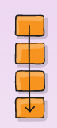
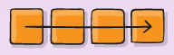

# FRONTEND-ESSENTIALS

## FlexBox

## taak02 - Flexbox Justify Content

### Introductie

Met Flexbox kunnen we de `as` veranderen.  Normaal gesproken loopt de as van de container zo:



De as is het pijltje. Dus van boven naar beneden. Alle items (divs) staan onder elkaar.

Als we de `as` van een `container` (doosje) veranderen dan verandert ook de volgorde van de items, zie vorige taak.

Je kunt de as dus van links naar recht laten gaan met `flex-direction: row;`



Als de as van links naar rechts gaat dan kun je ook de volgende CSS code toepassen: `justify-content:center;`

```css
    .container{
        display:flex;
        flex-direction: row;
        justify-content: center;
    }
```

De items komen dan in het midden te staan. Er zijn nog meer opties:


Try them all!

### Opdracht

1. Maak een navigatiemenu en stijl deze zo mooi mogelijk (google naar ideeën)
   - Maak gebruik van `<nav>`, `<ul>`, `<li>` en `<a>`
   - Maak ten minste gebruik van
     - `width`
     - `background-color` of `background`
     - `padding`
     - `border`
     - `display:flex`
     - `justify-content`
     - `list-style-type:none`
     - `color`
     - `font-family`
2. Bedenk op welke HTML-tag je een container moet aanbrengen met flexbox
3. Stel de container in op 100% width
4. Bedenk dat je list-item wilt stijlen met `list-style-type:none`
5. Pas de verschillende flexbox `justify-content` property toe. Welke heeft jouw voorkeur bij een menu?

### (mogelijk) Eindresultaat


### Bronnen

[A Complete Guide to Flexbox](https://css-tricks.com/snippets/css/a-guide-to-flexbox/)
